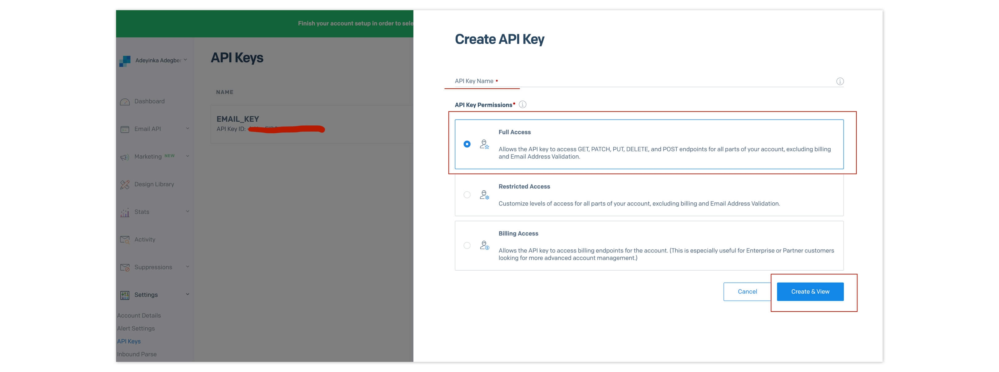
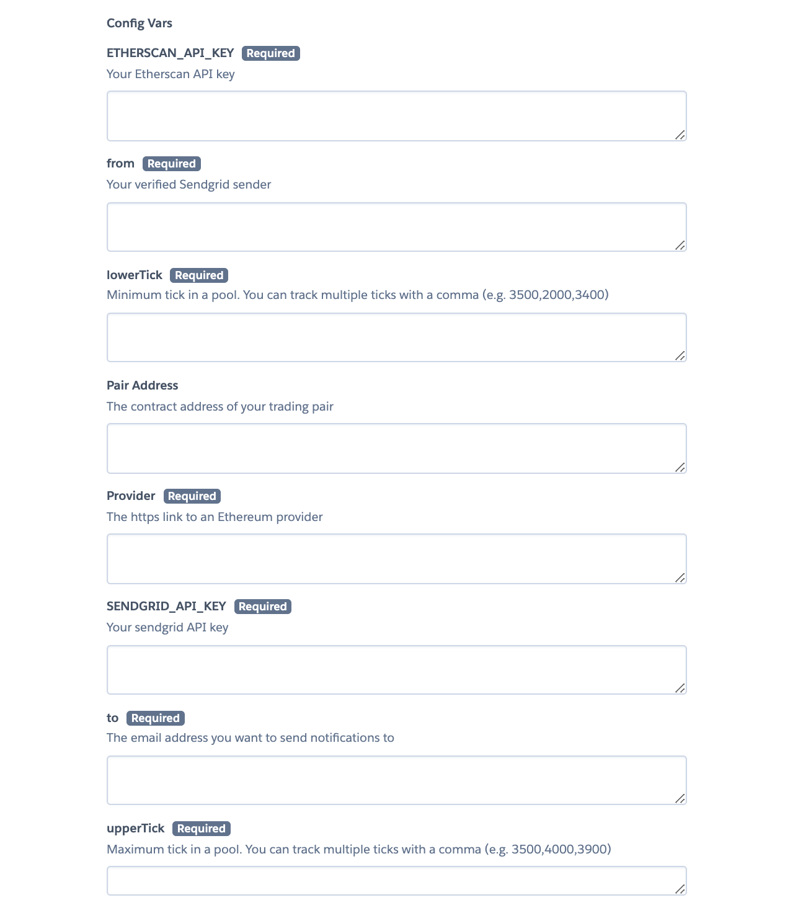
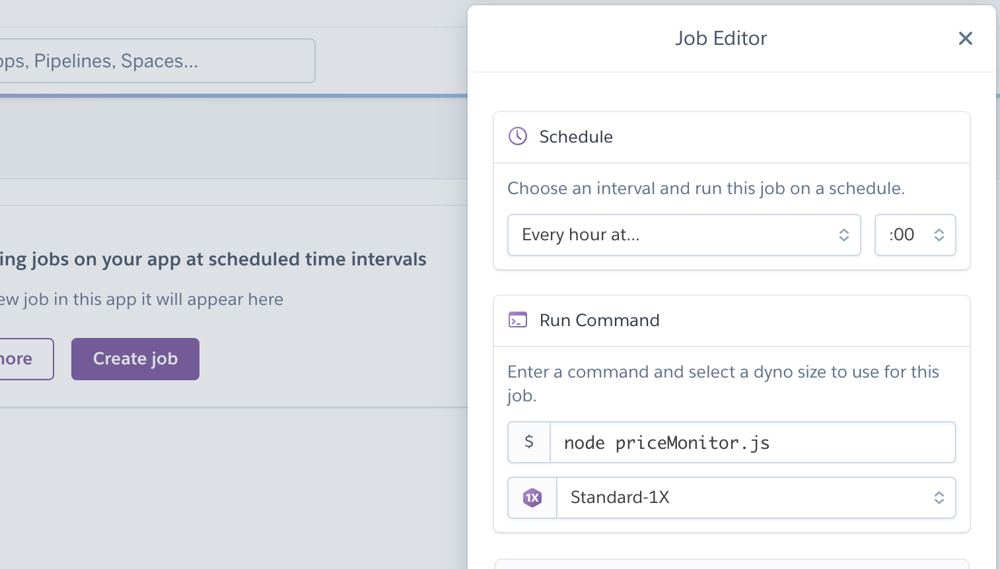

# Uniswap v3 LP Monitor

This is an open source uniswap v3 monitoring tool that lets you know when your trading pair is out of bounds.

Because Uniswap runs 24/7 without stopping, the only way to know if your trading pair is out of bounds is by constantly checking your Uniswap V3 dashboard. This monitoring tool can send email notifications to traders when they are no longer earning fees and help them know when to reroll profits or enter new LP positions.

## Setup

### 1. Get access to the SendGrid API

There are a variety of email-as-a-service platforms and APIs, such as SendGrid and Mailgun, among others. But for this project I used SendGrid, which allows you to send up to 100 emails per month for free.

To start sending emails with SendGrid, the first step is to sign up for the service. Then you’ll need to create a SendGrid API key for sending email.

To create an API key, go to Settings > API Keys on SendGrid’s dashboard, then click "Create API Key." Give the key a name, select "Full Access," then click "Create & View." Copy your API key and keep it safe for later use.

### 2. Generate an Etherscan API Key

* Create an account on Etherscan.
* Go to https://etherscan.io/myapikey, then click on Add to generate an API key.
* Copy the API Key and store in a safe place.

### 3. Connect to an Ethereum Node 

There are various Ethereum node providers available out there. You can register on Infura, Alchemy, etc. If you're using Infura for your project, you can connect to an endpoint by doing the following:

* Create an Infura account
* Go to https://infura.io/dashboard/ethereum/
* Navigate to settings
* Make sure you're on the Mainnet, then copy the generated address.

### 4. Specify your pair address and trading bounds

We'll be getting real-time on-chain prices of trading pairs via Chainlink. To consume the Chainlink Data Feeds, we need the contract address of the trading pair. You can get a list of the addresses [here](https://docs.chain.link/docs/ethereum-addresses/). For example, the USDC/ETH address is `0x986b5E1e1755e3C2440e960477f25201B0a8bbD4`.

Next, you'll need to specify the trading bounds you set in your LP positions. You do this by setting the following environment variables:

1. `lowerTick` - This is the minimum USD price per ETH set for your LP position. You can add multiple LP positions by adding a comma (e.g. `2000,2100,1000`)
2. `upperTick` - This is the maximum USD price per ETH set for your LP position. You can add multiple LP positions by adding a comma (e.g. `4000,4100,5000`)

### 5. Deploy to Heroku and add environment variables

When deploying, you'll need to add the environment variables from the previous steps to your new app.

### 6. Setup Heroku Scheduler

Finally, go to your Heroku project "Resources" tab and click the Heroku Scheduler Add-on.

Next, create a new job using the following settings:

- Schedule: `Every hour at..` (any time of your choosing)
- Run Command: `node priceMonitor.js`

### 7. (Optional) Get updates

If you want to get updates on this project as we continue to improve it, you'll need to create a fork of this repository to your Github account. 

Once you've done that, setup deployments to your Heroku application from your forked project. 
